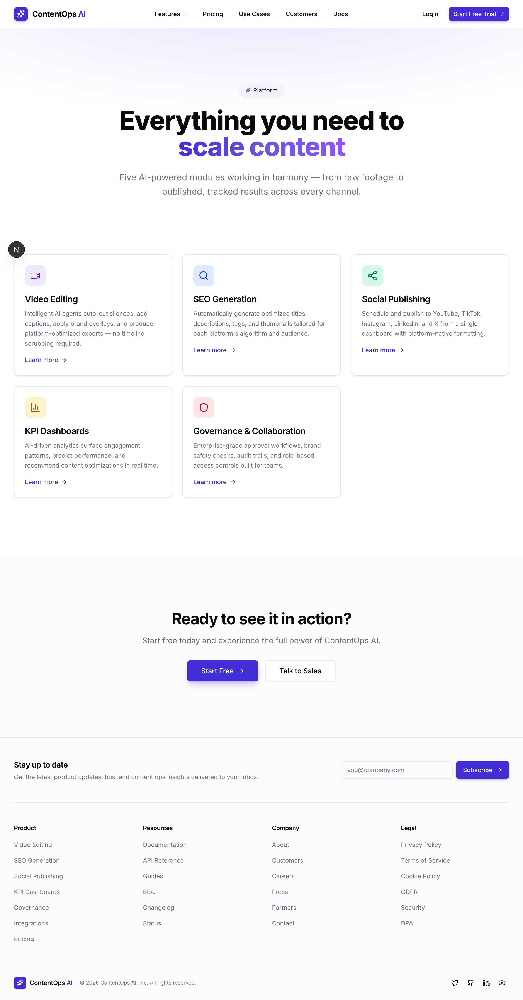
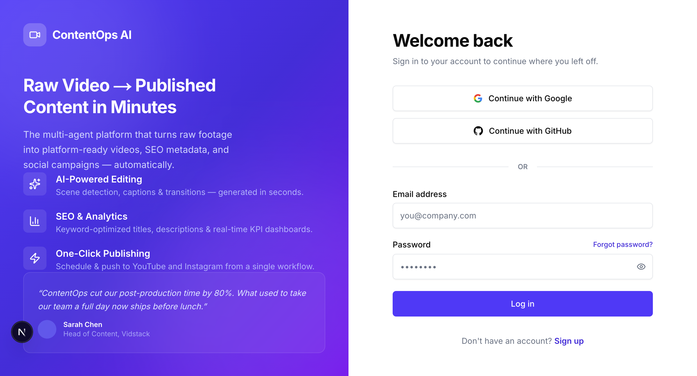
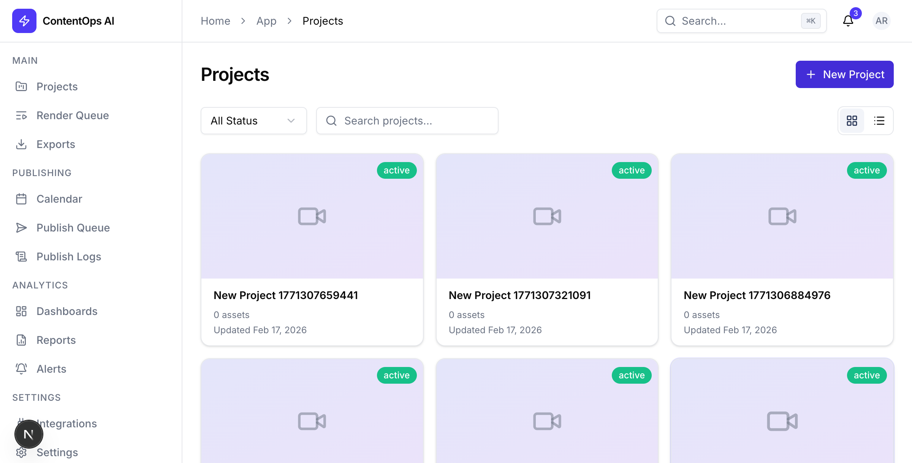

# ContentOps AI

**Raw Video → Published Content in Minutes**

ContentOps AI is a multi-agent SaaS platform that converts raw video assets into platform-ready content. It generates SEO-optimized metadata, automates social publishing across every major channel, and provides AI-driven KPI dashboards — all from a single, intelligent interface.

---

## Architecture

The application uses a **split architecture**: a Next.js frontend + auth layer that proxies API requests to a Python FastAPI backend handling all business logic.

```
Browser ──▶ Next.js :3000 (Frontend + Auth + Proxy) ──▶ Python FastAPI :8000 (Business Logic + DB)
                                                              │
                                                       data/contentops.db
```

| Layer | Role |
|-------|------|
| **Next.js** | React pages, components, NextAuth session management, API proxy (`/api/v1/*` → Python) |
| **Python FastAPI** | All CRUD routes, AI agents, video processing, database operations |
| **SQLite** | Shared database file at `data/contentops.db` |

---

## Features

- **AI Video Processing** — upload, FFprobe metadata extraction, scene detection, thumbnail generation
- **SEO Metadata Generation** — AI agent producing titles, descriptions, keywords (with intent), chapters, hashtags, engagement hooks, alt text, and on-screen text for Reels
- **Social Publishing** — full lifecycle: connect YouTube/Instagram accounts via OAuth → create campaigns → schedule posts → auto-publish via background scheduler
- **YouTube & Instagram API Integration** — resumable upload (YouTube Data API v3), container publish flow (Instagram Graph API)
- **OAuth 2.0** — Google OAuth for YouTube, Facebook OAuth for Instagram Business Accounts
- **Background Scheduler** — asyncio task that polls every 60s and auto-publishes due posts
- **KPI Dashboards & Reporting** — dashboard/report CRUD, anomaly detection + AI explanation, AI-powered KPI recommendations
- **5 AI Agents** — SEO generator, edit plan generator, anomaly explainer, report writer, KPI recommender
- **Auth + Roles + Org** — credential auth, registration, role-aware permissions (viewer/editor/admin/owner)
- **32 API Endpoints** — authenticated `/api/v1/*` surface covering all operations
- **SQLite Local-First** — file-based DB (`data/contentops.db`) with 25-table schema

### Notes

- AI routes require transcript/scene records to exist before generation calls succeed
- OAuth requires `GOOGLE_CLIENT_ID`/`GOOGLE_CLIENT_SECRET` and `FACEBOOK_APP_ID`/`FACEBOOK_APP_SECRET` in `.env.local`
- Without OAuth credentials, OAuth endpoints return descriptive 501 errors (no crashes)

---

## App Screenshots

### Marketing Features Page



### Login Experience



### Projects Dashboard



---

## Tech Stack

| Layer         | Technology                                                                 |
| ------------- | -------------------------------------------------------------------------- |
| Frontend      | [Next.js 16](https://nextjs.org/) (App Router), [React 19](https://react.dev/) |
| Styling       | [Tailwind CSS 4](https://tailwindcss.com/), [shadcn/ui](https://ui.shadcn.com/) |
| State         | [Zustand](https://zustand.docs.pmnd.rs/), [TanStack Query](https://tanstack.com/query) |
| Charts        | [Recharts](https://recharts.org/)                                          |
| **Backend**   | **[Python FastAPI](https://fastapi.tiangolo.com/)**                        |
| **ORM**       | **[SQLAlchemy](https://www.sqlalchemy.org/)**                              |
| Database      | [SQLite](https://www.sqlite.org/index.html)                                |
| Auth          | [NextAuth.js](https://next-auth.js.org/)                                   |
| AI            | [OpenAI Python SDK](https://github.com/openai/openai-python)              |
| Video Proc    | [ffmpeg / ffprobe](https://ffmpeg.org/) (via subprocess)                   |

---

## Getting Started

### Prerequisites

- **Node.js** ≥ 20 (Required for Next.js 16/React 19)
- **Python** ≥ 3.10
- **npm**
- **ffmpeg** (required for video processing features)

### Step 1: Install Dependencies

```bash
# Clone and enter the project
git clone https://github.com/your-org/contentops.git
cd contentops

# Install frontend dependencies
npm install

# Install backend dependencies
cd backend
python3 -m venv venv
source venv/bin/activate
pip install -r requirements.txt
cd ..
```

### Step 2: Configure Environment Variables

```bash
cp .env.example .env.local
```

Open `.env.local` and set at least these values:

```env
NEXTAUTH_SECRET=your-nextauth-secret-here
NEXTAUTH_URL=http://localhost:3000
LLM_API_URL=https://openrouter.ai/api/v1/
LLM_API_KEY=your-llm-api-key
PYTHON_BACKEND_URL=http://localhost:8000

# Optional: OAuth for social publishing
GOOGLE_CLIENT_ID=your-google-client-id
GOOGLE_CLIENT_SECRET=your-google-client-secret
FACEBOOK_APP_ID=your-facebook-app-id
FACEBOOK_APP_SECRET=your-facebook-app-secret
OAUTH_REDIRECT_BASE_URL=http://localhost:8000
```

Notes:
- Keep the trailing `/` in `LLM_API_URL`.
- SQLite is local by default at `./data/contentops.db` (no separate DB server required).
- The Python backend reads the same `.env.local` file automatically.
- OAuth credentials are only needed for YouTube/Instagram publishing. All other features work without them.

### Step 3: Database Setup

The project uses SQLite. Tables are created automatically on Python backend startup. For existing setups with Drizzle:

```bash
# Generate migrations (if using Drizzle CLI)
npx drizzle-kit generate

# Apply migrations
npx drizzle-kit migrate
```

### Step 4: Run Development Servers

You need **two terminals**:

```bash
# Terminal 1: Start Python backend
cd backend
source venv/bin/activate
python -m uvicorn app.main:app --port 8000 --reload
```

```bash
# Terminal 2: Start Next.js frontend
npm run dev
```

- Frontend: [http://localhost:3000](http://localhost:3000)
- Backend API: [http://localhost:8000](http://localhost:8000)
- API Docs (Swagger): [http://localhost:8000/docs](http://localhost:8000/docs)

### Step 5: Production Build

```bash
# Build Next.js for production
npm run build
npm run start

# Python backend (use gunicorn or similar for production)
cd backend && source venv/bin/activate
uvicorn app.main:app --host 0.0.0.0 --port 8000 --workers 4
```

---

## Project Structure

```
contentops/
├── src/                            # Next.js frontend
│   ├── app/                        # App Router (pages & layouts)
│   │   ├── (app)/                  # Authenticated app pages
│   │   ├── (auth)/                 # Login/signup pages
│   │   ├── (marketing)/            # Public marketing pages
│   │   └── api/                    # API proxy routes → Python backend
│   ├── components/                 # React components
│   │   ├── ui/                     # Reusable UI components (shadcn/ui)
│   │   └── ...                     # Feature-specific components
│   └── lib/                        # Utilities, hooks, and configuration
│       ├── api/proxy.ts            # Proxy helper (Next.js → Python)
│       ├── auth/                   # NextAuth configuration
│       └── db/                     # Drizzle schema (reference)
├── backend/                        # Python FastAPI backend
│   ├── app/
│   │   ├── main.py                 # FastAPI app entry point
│   │   ├── config.py               # Settings (pydantic-settings)
│   │   ├── database.py             # SQLAlchemy engine + session
│   │   ├── dependencies.py         # Auth context dependency
│   │   ├── models/                 # SQLAlchemy ORM models (25 tables)
│   │   ├── routers/                # API route handlers (15 routers)
│   │   ├── schemas/                # Pydantic request/response schemas
│   │   └── services/               # Business logic
│   │       ├── ai_client.py        # OpenAI client setup
│   │       ├── seo_generator.py    # SEO brief generation agent
│   │       ├── edit_plan_generator.py  # Edit plan generation agent
│   │       ├── anomaly_explainer.py    # Anomaly explanation agent
│   │       ├── report_writer.py    # Report summary writer agent
│   │       ├── kpi_recommender.py  # KPI recommendation agent
│   │       ├── publisher.py        # YouTube + Instagram API publishing
│   │       ├── scheduler.py        # Background auto-publish scheduler
│   │       └── video/              # Video processing (ffmpeg)
│   ├── requirements.txt            # Python dependencies
│   └── venv/                       # Python virtual environment
├── data/                           # SQLite database + uploads
│   ├── contentops.db               # Main database
│   └── uploads/                    # Uploaded video files
├── public/                         # Static assets
└── ...
```

---

## API Reference

All API routes are available under `/api/v1/*`. The Next.js frontend proxies requests to the Python backend.

### Auth
| Method | Endpoint | Description |
|--------|----------|-------------|
| GET | `/api/v1/auth` | Get current user context + permissions |
| POST | `/api/v1/auth/register` | Register new user + org |

### Content Operations
| Method | Endpoint | Description |
|--------|----------|-------------|
| GET/POST | `/api/v1/projects` | List / create projects |
| GET | `/api/v1/assets` | List video assets |
| POST | `/api/v1/assets/upload` | Upload video file (multipart) |
| POST | `/api/v1/assets/process` | Process asset (scene detection + transcript) |
| GET/POST | `/api/v1/render-jobs` | List / create render jobs |
| GET | `/api/v1/exports` | List exported files |

### AI Agents
| Method | Endpoint | Description |
|--------|----------|-------------|
| POST | `/api/v1/ai/seo-generate` | Generate SEO metadata from transcript |
| POST | `/api/v1/ai/edit-plan-generate` | Generate edit plan from scenes |
| POST | `/api/v1/ai/anomaly-explain` | Explain KPI anomaly |
| POST | `/api/v1/ai/kpi-recommend` | AI-recommended KPIs based on business context |

### Social Publishing
| Method | Endpoint | Description |
|--------|----------|-------------|
| GET/POST | `/api/v1/social-accounts` | List / connect social accounts |
| DELETE | `/api/v1/social-accounts/{id}` | Disconnect social account |
| POST | `/api/v1/social-accounts/{id}/refresh-token` | Refresh OAuth token |
| GET/POST | `/api/v1/scheduled-posts` | List / create scheduled posts |
| PATCH | `/api/v1/scheduled-posts/{id}` | Update post metadata |
| POST | `/api/v1/scheduled-posts/{id}/approve` | Approve draft → scheduled |
| POST | `/api/v1/scheduled-posts/{id}/publish` | Manually trigger publish |
| POST | `/api/v1/scheduled-posts/{id}/cancel` | Cancel scheduled post |
| GET | `/api/v1/scheduled-posts/{id}/events` | View publish event history |

### OAuth
| Method | Endpoint | Description |
|--------|----------|-------------|
| GET | `/api/v1/oauth/youtube/authorize` | Get Google OAuth URL |
| GET | `/api/v1/oauth/youtube/callback` | Handle YouTube OAuth callback |
| GET | `/api/v1/oauth/instagram/authorize` | Get Facebook/Instagram OAuth URL |
| GET | `/api/v1/oauth/instagram/callback` | Handle Instagram OAuth callback |

### Distribution & Analytics
| Method | Endpoint | Description |
|--------|----------|-------------|
| GET/POST | `/api/v1/campaigns` | List / create campaigns |
| GET/POST | `/api/v1/dashboards` | List / create dashboards |
| GET | `/api/v1/reports` | List reports |
| GET/POST | `/api/v1/alerts` | List / create alerts |
| GET | `/api/v1/seo-briefs` | List SEO briefs |
| GET | `/api/v1/billing` | Get billing info |

### Interactive API Docs

When the Python backend is running, visit [http://localhost:8000/docs](http://localhost:8000/docs) for auto-generated Swagger documentation.

---

## Feature Walkthrough (Step by Step)

### 1) Auth + Roles + Org Support

1. Start both servers (see [Getting Started](#step-4-run-development-servers))
2. Register: open `/signup` and create an account (calls `POST /api/v1/auth/register`)
3. Login: open `/login` and sign in (NextAuth credentials via `/api/auth/[...nextauth]`)
4. Verify auth context: call `GET /api/v1/auth` after login

### 2) AI Video Processing

1. Create/select a project in `/app/projects`
2. Upload a video with `POST /api/v1/assets/upload` using form-data: `file`, `projectId`
3. Run processing for that asset with `POST /api/v1/assets/process` and `{ "assetId": "<ASSET_ID>" }`
4. Backend actions (handled by Python FastAPI):
   - file saved under `data/uploads/<orgId>/<assetId>/original/`
   - metadata extracted with FFprobe (`durationMs`, `resolution`, `codec`, `sizeBytes`)
   - scene boundaries detected and saved in `scenes`
   - transcript record generated and saved in `transcripts`
   - thumbnail generated and asset marked `ready`
5. View assets via `GET /api/v1/assets?project_id=<projectId>`

### 3) SEO Metadata Generation

1. Ensure `.env.local` has `LLM_API_URL` and `LLM_API_KEY`
2. Ensure transcript exists for the uploaded asset (required by API)
3. Call `POST /api/v1/ai/seo-generate` with:
   - `assetId`
   - `platform` (`youtube` | `instagram` | `both`)
   - optional `targetAudience`
4. Read generated briefs from `GET /api/v1/seo-briefs?project_id=<projectId>`

### 4) Social Publishing Workflows

1. **Connect accounts**: call `GET /api/v1/oauth/youtube/authorize` or `GET /api/v1/oauth/instagram/authorize` to get an OAuth URL, redirect the user, and the callback stores tokens automatically
2. **Verify connection**: `GET /api/v1/social-accounts` lists connected accounts
3. **Create a campaign**: `POST /api/v1/campaigns`
4. **Schedule a post**: `POST /api/v1/scheduled-posts` with `campaignId`, `accountId`, `platform`, `scheduledAt`
5. **Approve**: `POST /api/v1/scheduled-posts/{id}/approve` moves status from `draft` → `scheduled`
6. **Auto-publish**: the background scheduler picks up due posts and publishes them automatically
7. **Manual publish**: `POST /api/v1/scheduled-posts/{id}/publish` triggers immediate publishing
8. **Monitor**: `GET /api/v1/scheduled-posts/{id}/events` shows publish event history with platform URLs, error codes, and retry counts

### 5) KPI Dashboards / Reporting

1. Create dashboard: `POST /api/v1/dashboards` or use `/app/dashboards`
2. **Get AI KPI recommendations**: `POST /api/v1/ai/kpi-recommend` with `industry`, `businessType`, `goals` — returns prioritized KPIs with visualization types and targets
3. List dashboards: `GET /api/v1/dashboards`
4. View reports in `/app/reports` using `GET /api/v1/reports`
5. Use AI anomaly explain route when anomaly data exists: `POST /api/v1/ai/anomaly-explain`

### Edited Output Pipeline (API)

1. Upload raw video: `POST /api/v1/assets/upload`
2. Process asset (scene detection + transcript): `POST /api/v1/assets/process`
3. Generate edit plan from detected scenes: `POST /api/v1/ai/edit-plan-generate`
4. Render edited output and create export: `POST /api/v1/render-jobs`
5. Retrieve final downloadable metadata: `GET /api/v1/exports`

---

## Documentation

Comprehensive architectural documentation is available in the [`blueprint`](../blueprint) directory:

*   [Overview](../blueprint/00_OVERVIEW.md)
*   [Information Architecture](../blueprint/01_INFORMATION_ARCHITECTURE.md)
*   [User Journey Mapping](../blueprint/02_USER_JOURNEY_MAPPING.md)
*   [Data Architecture](../blueprint/03_DATA_ARCHITECTURE.md)
*   [API Surface & Integrations](../blueprint/04_API_SURFACE_INTEGRATIONS.md)
*   [Component System](../blueprint/05_COMPONENT_SYSTEM.md)
*   [Page Blueprints](../blueprint/06_PAGE_BLUEPRINTS.md)
*   [Tech Stack](../blueprint/07_TECH_STACK.md)
*   [Performance & SEO](../blueprint/08_PERFORMANCE_SEO.md)

---

## License

This project is licensed under the [MIT License](LICENSE).
